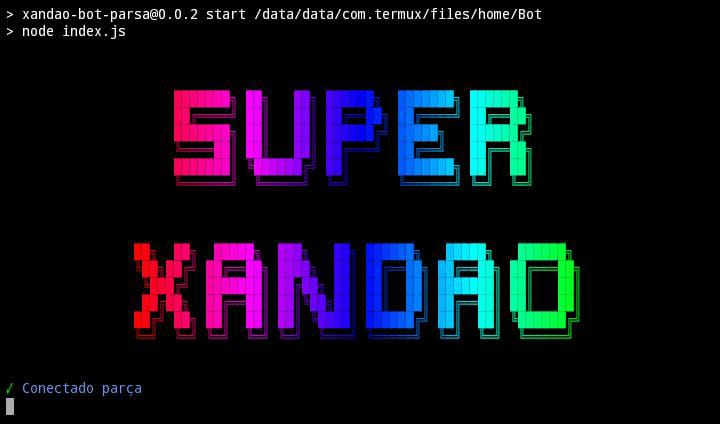

	

	

	

<h1> ⚡SUPER XANDÃO⚡ e um Bot de whatsapp feito com a base de um dos meu YouTubers favoritos "Causs"</h1>

<a href="https://youtube.com/CaussZ"> Causs </a>

Comandos pra instalar:

* `termux-setup-storage`

* `apt-get update `

* `apt-get upgrade `

* `pkg install git `

* `pkg install ffmpeg `

* `pkg instal wget `

* `pkg install nodejs `

* `git clone https://github.com/Meliodas-rai/Bot `

* `cd Bot `

* `bash install.sh `

* `npm start `

* ESCANEIE O QR CODE QUE IRA APARECER COM O WHATSAPP 

## Comandos do PM2 Monit

* aperte o botão "CTRL" depois vá no teclado e aperte "C" Depois digite:

* `npm i -g pm2 `

* `pm2 start index.js `

* `pm2 monit `

## Comandos para ligar o bot novamente

* `cd Bot`

* `git pull `

* `npm start `

* APERTE NO BOTÂO "CTRL" DEPOIS VA NO TECLADO E APERTE "C" E DIGITE O SEGUINTE:

* `pm2 start index.js `

* `pm2 monit `

## MATERIAL

* termux e dois celulares 

* OBS: o bot só pode ser instalador em celulares com o androind acima de 4.0 ou 5.0

<h3 align="center">⚡SUPER XANDÃO⚡</h3>
